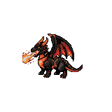
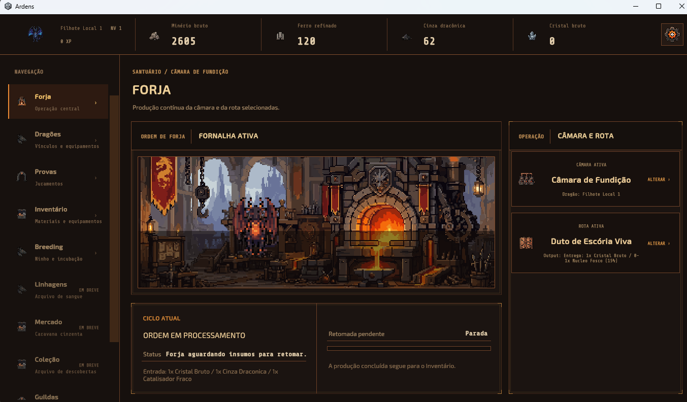
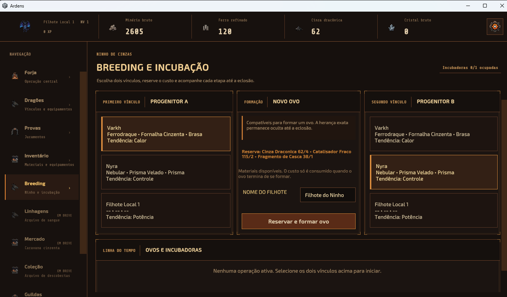
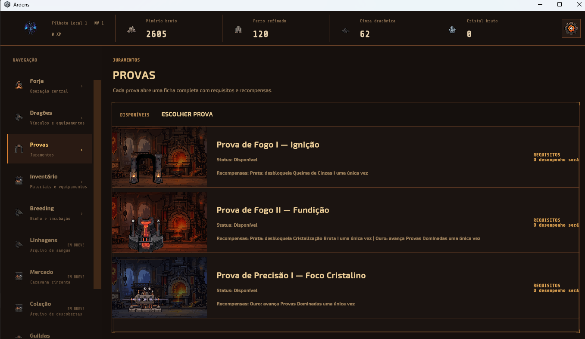

# ARDENS

> A pixel-art idle/AFK game about raising, progressing and managing dragons — built in Unity and developed as an evolving personal software project.


<p align="center">
  
</p>

## The project

ARDENS is a personal Unity project built with C#. It combines a functional idle/AFK loop with dragons, progression, forging, inventory, breeding, trials and persistent state.

The MVP established the core loop. The current phase is a visual and UX rework focused on clearer hierarchy, consistent pixel-art presentation and a stronger identity across the interface.

The full production source remains private. This repository is the public portfolio layer: real visual evidence, architecture notes, development decisions and selected safe-to-share material.

## What is already demonstrated

- A working Unity desktop MVP.
- Data-driven progression and economy-oriented systems.
- Dragon collection, equipment, breeding and incubation flows.
- Forge, inventory and trial-oriented gameplay screens.
- Persistent game-state concerns and reusable UI patterns.
- AI-assisted development with human review and local validation.

## Visual showcase

These images come from the project and show the current direction of the playable interface.

<table>
  <tr>
    <td></td>
    <td></td>
    <td></td>
  </tr>
  <tr>
    <td align="center">Forge</td>
    <td align="center">Breeding</td>
    <td align="center">Trials</td>
  </tr>
</table>

The walking GIF is assembled from the dragon animation frames in [`assets/frames/walking/`](assets/frames/walking/). Directional sprite references are kept in [`assets/sprites/dragons/`](assets/sprites/dragons/).

## Machine learning direction: DragonLab

ARDENS will also include a machine-learning laboratory for balance testing.

DragonLab is planned as a headless simulation environment that uses the same economy and progression rules as the game. Different agent profiles will test dominant strategies, idle periods, upgrade ROI and balance regressions across thousands of reproducible runs.

The boundary is intentional:

- ML is a development tool, not a player-facing dependency.
- The simulation should reuse the game's real rules instead of a parallel fake economy.
- Telemetry produces evidence and anomalies, not automatic balance changes.
- Codex may explain results and propose changes, but design approval remains human.

See the [DragonLab roadmap](docs/ROADMAP.md) for the planned implementation stages.

## Engineering with AI

OpenAI Codex is used as an engineering tool for inspecting unfamiliar code, planning multi-file changes, refactoring, maintaining documentation and structuring visual-asset workflows.

Generated suggestions are reviewed against project context, tested in Unity and adjusted when necessary. The goal is faster iteration while preserving ownership of architecture, product decisions and validation.

Read the [AI-assisted development workflow](docs/AI-WORKFLOW.md) and the [architecture overview](docs/ARCHITECTURE.md).

## Public repository structure

```text
assets/
  screenshots/       Real UI captures used in the showcase
  gifs/              Short presentation animations
  frames/walking/    Source frames for the walking showcase
  sprites/dragons/   Selected directional sprite references

docs/
  ARCHITECTURE.md    Portfolio-safe architecture overview
  AI-WORKFLOW.md     AI-assisted development process
  ROADMAP.md         Visual, engineering and DragonLab direction
```

## Public boundary

This repository intentionally does not contain:

- full production source code;
- proprietary or third-party licensed packages;
- credentials or private service configuration;
- unapproved production assets.

The public material exists to demonstrate engineering judgment, iteration, documentation and visual direction.

## About the developer

ARDENS is developed by **Lucas Queiroz**, Computer Science student and software-development intern working primarily with Java/Spring Boot professionally and C#/Unity in this project.

- GitHub: [Lucas-F-Queiroz](https://github.com/Lucas-F-Queiroz)
- LinkedIn: [lucas-queiroz-54a21b233](https://www.linkedin.com/in/lucas-queiroz-54a21b233/)
